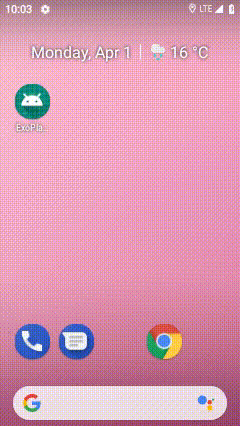

# Audio player sample app

This is a sample project where I experimented with [ExoPlayer](https://github.com/google/ExoPlayer)

## Libraries/architecture used
- ExoPlayer 2
- Dagger 2
- Android Architecture Components

## What's implemented?
- Loading multiple media sources
- Music playback with a system notification synchronised with playback actions
- Error handling
- Audio Service is in a separate Gradle module - the main module does not know anything about ExoPlayer nor the Service itself

## How does it look like?

## TODOs
- Loading music list from an external source e.g. a Web Service via Kotlin coroutines
